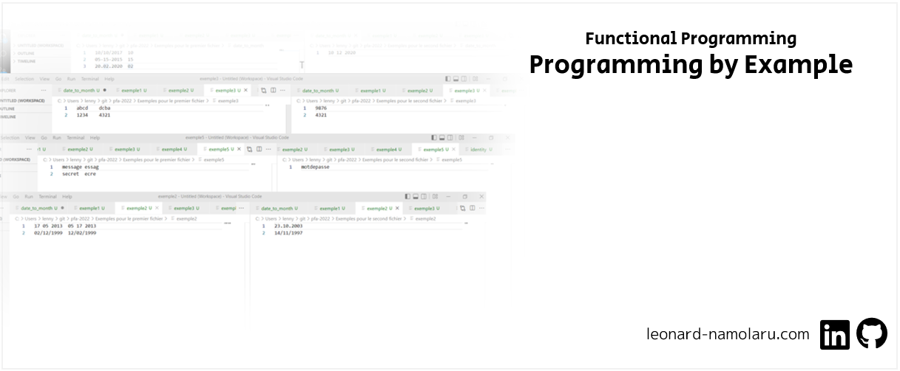

### [Français] Programmation Fonctionnelle: Produire un programme selon des exemples
> :school: **Lieu de formation :** Université Paris Cité, Campus Grands Moulins (ex-Paris Diderot)
> 
> :books: **UE :** Programmation Fonctionnelle Avancée 
> 
> :pushpin: **Année scolaire :** M1
> 
> :calendar: **Dates :** avr. 2022 - mai 2022 
> 
> :chart_with_upwards_trend: **Note :** 15/20

